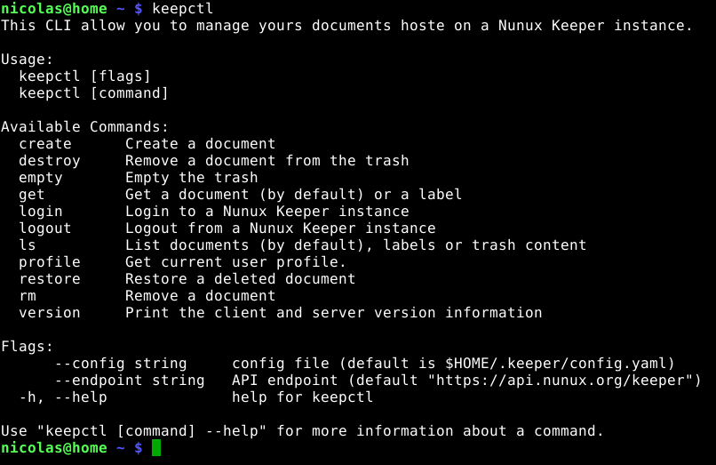

[](https://travis-ci.org/nunux-keeper/keeper-cli)

keeperctl
=========

Official <a href="http://keeper.nunux.org" target="_new">Nunux Keeper V2</a>
CLI.

Please note that this CLI is not compatible with Nunux Keeper V1.



Install
-------

Run the following command:

```bash
> go get -v github.com/nunux-keeper/keeper-cli/keepctl
```

Or download the binary regarding your architecture:

```bash
> sudo curl -s https://raw.githubusercontent.com/nunux-keeper/keeper-cli/master/install.sh | sh
```

Or use Docker:

```bash
> docker run --rm -it ncarlier/keepctl
```

Usage
-----

Just type `keepctl` to see available commands.


```bash
> keepctl
```

----------------------------------------------------------------------

NUNUX Keeper

Copyright (c) 2016 Nicolas CARLIER (https://github.com/ncarlier)

This program is free software: you can redistribute it and/or modify
it under the terms of the GNU General Public License as published by
the Free Software Foundation, either version 3 of the License.

This program is distributed in the hope that it will be useful,
but WITHOUT ANY WARRANTY; without even the implied warranty of
MERCHANTABILITY or FITNESS FOR A PARTICULAR PURPOSE.  See the
GNU General Public License for more details.

You should have received a copy of the GNU General Public License
along with this program.  If not, see <http://www.gnu.org/licenses/>.

----------------------------------------------------------------------
